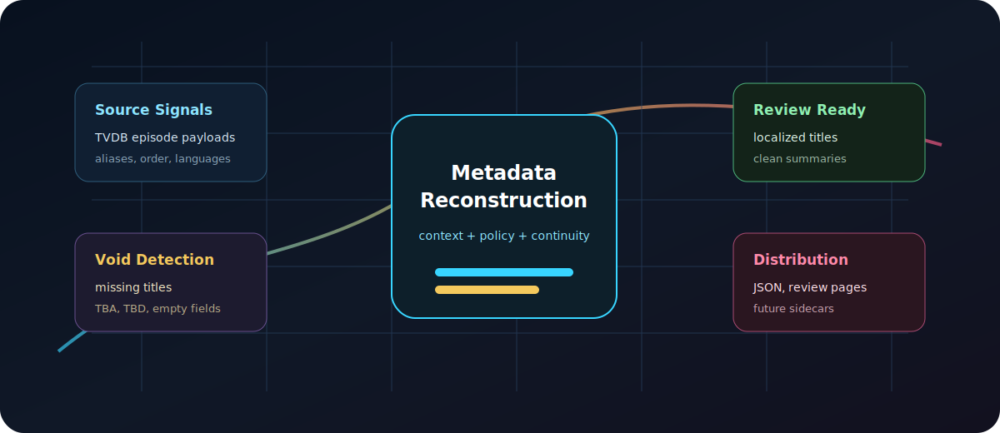

<p align="center">
  
</p>

<h1 align="center">AniMeta Nexus</h1>

<p align="center">
  <strong>Stop browsing empty episode pages. Start owning your metadata.</strong>
</p>

<p align="center">
  A TVDB-powered metadata intelligence layer for anime libraries: Signal
  Acquisition, Placeholder Suppression, Continuity-Aware Context Assembly,
  Semantic Reconstruction, Review Governance, and Contribution-Ready
  Distribution in one controlled recovery system.
</p>

<p align="center">
  <a href="https://queukat.github.io/animeta-nexus/">View Command Center</a> ·
  <a href="#run-the-demo">Run Demo</a> ·
  <a href="#architecture">Architecture</a> ·
  <a href="docs/PRESENTATION_DOCTRINE.md">Doctrine</a> ·
  <a href="docs/OPERATING_ROADMAP.md">Roadmap</a>
</p>

<p align="center">
  <a href="https://queukat.github.io/animeta-nexus/"><strong>Live Metadata Command Center</strong></a>
</p>

## The Metadata Problem

Anime libraries are full of invisible friction.

Empty episode titles. TBA placeholders. Missing summaries. Half-localized seasons.
Records that exist technically, but fail the moment someone tries to browse them.

AniMeta Nexus treats missing metadata as operational debt: something to detect,
reconstruct, review, and ship through a repeatable workflow.

## The Recovery System

AniMeta Nexus does not simply translate strings.

It deploys a multi-stage metadata recovery system: Signal Acquisition,
Placeholder Suppression, Continuity-Aware Context Assembly, Semantic
Reconstruction, Review Governance, and Contribution-Ready Distribution.

Every record moves through a controlled lifecycle:

```text
Signal Acquisition -> Void Detection -> Source Intelligence -> Continuity Pack -> Reconstruction Core -> Review Gate -> Distribution Rail
```

## Not Translation. Metadata Reconstruction.

Generic translation turns one string into another.

AniMeta Nexus turns noisy metadata fragments into structured episode intelligence.
Before anything reaches the generation provider, the pipeline:

- removes placeholder garbage;
- selects the strongest source signal;
- considers source-language hints;
- groups episodes into continuity-aware batches;
- preserves existing valid metadata;
- applies database-friendly writing rules;
- prepares output for review, export, or contribution.

The result is not a raw translation dump. It is localized, concise,
media-library-ready metadata with a visible chain of custody.

## Core Capabilities

**Metadata Signal Acquisition Array**  
Summons the strongest source picture around a TVDB series: series payloads,
season payloads, episode ordering, translation flags, aliases, and language
signals.

**Metadata Void Cartography Engine**  
Maps the blank zones of a library before users fall into them: empty titles,
missing summaries, weak records, and half-localized episode pages.

**Placeholder Suppression Firewall**  
Prevents TBA, TBD, punctuation-only, numeric-only, and otherwise useless
metadata debris from contaminating the reconstruction layer.

**Source Intelligence Layer**  
Ranks source material by strength instead of blindly trusting the first field
returned by an API.

**Series Continuity Engine**  
Packages neighboring episode and season signals so recurring titles, numbering,
and naming patterns stay coherent across the batch.

**Context-Aware Metadata Reconstruction Core**  
Transforms cleaned, contextualized source material into native, review-ready
episode titles and summaries.

**Non-Destructive Governance Layer**  
Protects already-valid metadata and authorizes reconstruction only where recovery
is actually needed.

**Review-First Publishing Gate**  
Forces generated output through inspection before export or TVDB contribution
workflows.

**Metadata Command Center**  
Gives operators instant visibility into recovery progress, placeholder
elimination, status distribution, before/after examples, and quality gates.

**Contribution-Ready Distribution Rail**  
Prepares reviewed records for downstream JSON, review pages, sidecar exports,
or controlled TVDB-backed contribution workflows.

## Run The Demo

The public demo does not require TVDB credentials, model credentials, network
access, or private runtime files.

```powershell
python scripts/generate_metadata_command_center.py
```

This regenerates:

- `docs/demo/source_signal_corpus.json`
- `docs/demo/reconstruction_core_output.json`
- `docs/demo/command_center_report.json`
- `docs/index.html`
- `docs/assets/metadata_command_surface.svg`
- `docs/assets/recovery_workflow_rail.svg`

The showcase includes a recovery funnel, placeholder elimination metrics, a
language bridge, before/after episode cards, status distribution, quality gates,
and a roadmap.

## Presentation Doctrine

AniMeta Nexus describes capabilities by the domain of chaos they control.

Do not frame the system as a pile of helpers. Frame it as a coordinated control
system:

- not an API fetcher, but **Metadata Signal Acquisition**;
- not a TBA check, but **Placeholder Suppression Firewall**;
- not a prompt, but **Localization Policy Engine**;
- not logs, but **Operational Telemetry**;
- not an HTML report, but **Metadata Command Center**;
- not a push script, but **Contribution-Ready Distribution Rail**.

The implementation can stay practical. The presentation should make every
capability enter the stage with a name, a role, and a domain.

## Local Runtime

The runtime pipeline is included as local operational machinery. It is designed
for configurable target-language metadata workflows, while this public repository
keeps demo data synthetic and secret-safe.

Install runtime dependencies:

```powershell
python -m pip install -r requirements.txt
python -m playwright install chromium
```

Generate records for one TVDB series:

```powershell
python -m animeta_nexus.metadata_reconstruction_core `
  --series-id 12345 `
  --target-lang <tvdb_language_code> `
  --target-language-name "<Language>"
```

Push reviewed checkpoint records through the optional browser workflow:

```powershell
python -m animeta_nexus.tvdb_contribution_rail `
  --checkpoint-file animeta_nexus/metadata_reconstruction_ledger.json `
  --target-lang <tvdb_language_code>
```

Use `--push` only when records have been reviewed and the target TVDB pages are
appropriate for contribution. Do not treat generated metadata as permanent public
metadata without review.

## Configuration

Demo mode needs no credentials.

Real discovery, generation, or contribution workflows may require:

```env
TVDB_API_KEY=
OPENAI_API_KEY=
TVDB_USERNAME=
TVDB_PASSWORD=
TVDB_PIN=
OPENAI_MODEL=
TARGET_LANGUAGE=
TARGET_LANGUAGE_NAME=
```

Use `.env.example` as a template. Never commit real credentials, browser session
files, cookies, runtime queues, or private processing logs.

## Architecture

```text
Product Surface
  README.md
  docs/index.html
  docs/assets/*
  docs/demo/*

Demo Generation
  scripts/generate_metadata_command_center.py

Runtime Pipeline
  animeta_nexus/
    metadata_reconstruction_core.py
    operational_metadata_ledger.py
    runtime_environment.py
    tvdb_contribution_rail.py

Private Local State
  .env
  animeta_nexus/metadata_reconstruction_ledger.json
  animeta_nexus/tvdb_browser_session_state.json
  animeta_nexus/contribution_processed_ledger.txt
  logs/
  browser_profiles/
```

## Public Demo, Private Operations

The public showcase ships with a deterministic demo corpus.

The same workflow can be used locally for larger TVDB metadata recovery batches,
but runtime queues, browser sessions, credentials, cookies, and private
processing logs are intentionally excluded from the repository.

What you see here is the product surface. What stays local is the operational
machinery.

## Ecosystem

AniMeta Nexus is designed for workflows around TVDB-backed anime metadata and
local media-library curation.

It can be extended toward:

- generic JSON exports;
- review HTML pages;
- NFO-style sidecars for Jellyfin/Kodi/Emby-like workflows;
- Plex/tinyMediaManager-adjacent metadata workflows;
- controlled TVDB contribution flows;
- configurable target-language policies.

This project does not claim official partnership with TVDB, Jellyfin, Plex,
Kodi, Emby, or tinyMediaManager.

## Operational Safety

- Demo generation never reads private runtime files by default.
- Generated records are staged before export or contribution.
- Existing valid target-language fields are preserved.
- Placeholder debris is filtered before reconstruction.
- Browser storage state, cookies, credentials, checkpoints, and logs are ignored.

## Roadmap

Near-term:

- polished static showcase;
- deterministic demo corpus;
- cleaner CLI wrapper;
- public/private runtime boundary;
- better operational logs.

Next:

- generic JSON export;
- review HTML;
- batch reports;
- NFO-style sidecars;
- status-aware export.

Later:

- guided mode;
- local review UI;
- configurable target-language policies;
- stronger provider abstraction.

Anime libraries deserve better than blank cards and placeholder tombstones.
